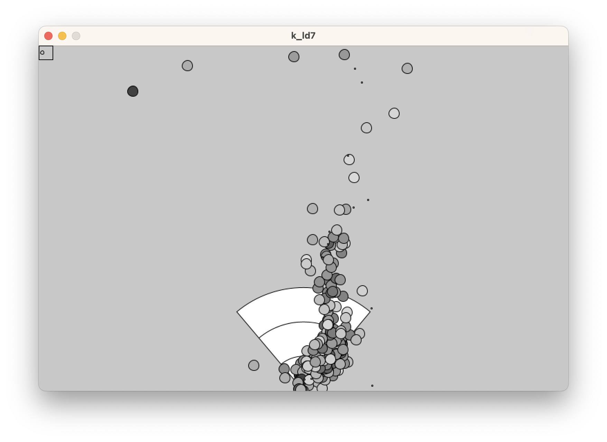
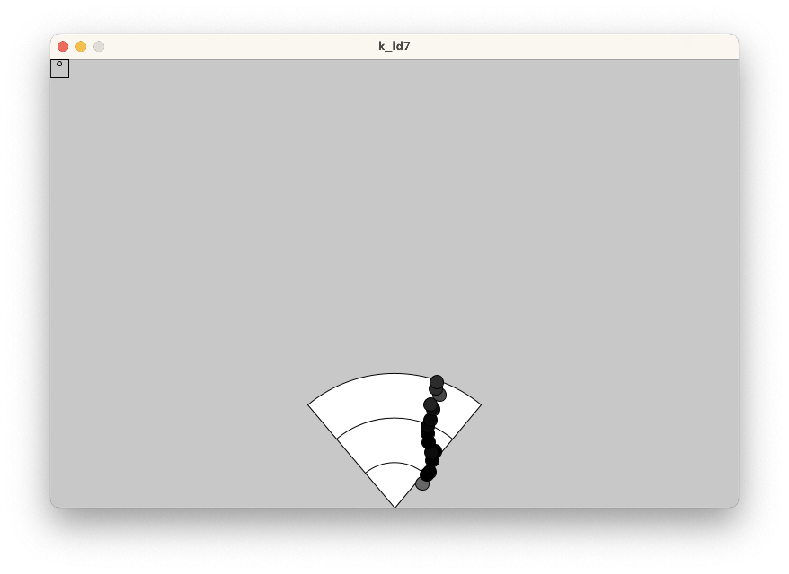

# kld7-processing

kld7-processing is a simple application written in processing to visualise the data from a K-LD7 Doppler radar module. It's a simple proof-of-concept app to test communication with the module and log the data to allow later development of algorithms to work with that data. There's little to no error handling, and the code isn't exactly pretty. Be warned!

The module is expected to be connected to the PC via some sort of serial-to-USB adapter, such as an FTDI.

There are a few variables at the top of k-ld7.pde that need to be changed. The most important is the path to the serial port. You can expect that this tool won't run until you change this variable.

You can also choose between PDAT and TDAT mode. In PDAT mode the K-LD7 will return all the targets it has received. Up to 8 targets can be received simultaneously. The data contains a lot of reflections and noise, but you get a range of up to 100m. The screenshot shows all data points received from a single passing car:

The other mode, TDAT, asks the module to track the most prominent target. You get a single point each time and the range is limited to 30m, but the data looks much, much cleaner.

All data points received by this tool are logged in a tab-separated file called log.tsv in the same folder as the source of the application. It will be overwritten each time this tool is started, so remember to copy it to a different location if you want to use it later.